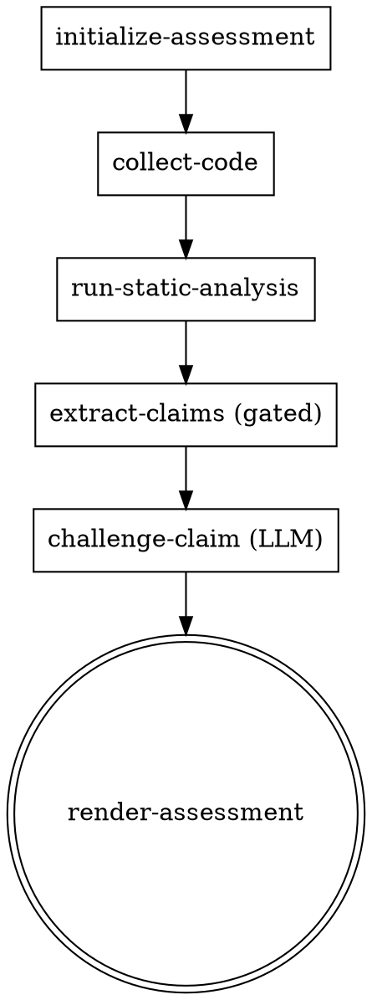

# Using cyberkinetic

## Overview

cyberkinetic assesses the security posture of cyber-physical products. It is a **cascade
of skills over a per-assessment SQLite database**: each skill reads the current
assessment state, does one bounded piece of work, and writes its result back. The
database is the interface — no skill depends on another skill's conversation, only on
what is committed to the assessment store.

**Core principle:** claims are assertions *about the corpus*, never truth about the world.
The pipeline tracks where each claim came from and, for code, whether its citation
actually resolves. See `docs/DESIGN.md` and `docs/GLOSSARY.md`.

## Phase 1 scope

Phase 1 is a **thin, straight-through pass**: source code at pinned commits + CodeQL/SARIF
only. One pass, no loops, no interviews, no findings-elevation. The goal is a real
end-to-end result — cited, challenged claims a human can curate — not feature completeness.

## The cascade (run in order)

| Order | Skill | Kind | Reads | Writes |
|---|---|---|---|---|
| 1 | `initialize-assessment` | script | issue-form input | assessment, in_scope_repo, declared_source |
| 2 | `collect-code` | script | in_scope_repo | checkouts (cache), collected flag |
| 3 | `run-static-analysis` | script | checkouts | analysis_run (raw SARIF) |
| 4 | `extract-claims` | script (gated) | analysis_run | claim, citation |
| 5 | `challenge-claim` | **LLM** | claim + code | verdict claims |
| 6 | `render-assessment` | script | claim + verdict | render_output (access-controlled) |

## Choosing the next skill

- **No assessment row yet?** → `initialize-assessment`.
- **Assessment exists, `status` tells you where you are.** Each skill advances `status`:
  `initialized → collecting → analyzing → extracted → challenged → rendered`.
- Run the skill whose input state matches the current `status`. Each skill's HARD-GATE
  refuses to run out of order, so when in doubt, invoke the next one and let its gate check.

## Determinism

Five of six skills are deterministic scripts the agent merely invokes. Only
`challenge-claim` is an LLM skill, because judging whether a finding is a false positive
is irreducible reasoning. Do not push judgment into the scripts, and do not let the LLM
skill do work a script could do deterministically. See `docs/adr/0009`.

## Stub status

Phase 1 ships with **stub scripts** under `scripts/` that echo their intended action and
arguments, then exit 0. This lets the full cascade run end-to-end and be inspected before
any real collection/extraction logic exists. Replacing a stub with a real implementation
is the implementer's job and must not change the skill's gate or its DB pre/postconditions.

`initialize-assessment` is implemented for real (not a stub) — it reads a
`repo-scope-resolved` GitHub issue via `gh`, enforces its own HARD-GATE, and writes the
assessment's initial DB state. See `skills/initialize-assessment/SKILL.md`.
